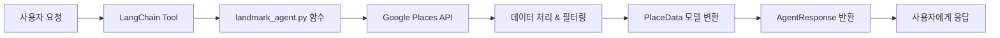

[landmark_tools_guide.md](https://github.com/user-attachments/files/24213965/landmark_tools_guide.md)
# 관광지 에이전트 툴 가이드

## 📋 개요

관광지 에이전트는 **올인원 트래블 가이드** 시스템의 핵심 에이전트로, 사용자에게 최고의 관광지, 테마파크, 박물관 등을 추천하고 상세 정보를 제공합니다.

## 🎯 주요 기능

관광지 에이전트는 총 **5개의 LangChain 툴**을 제공합니다:

1. **장소 검색** (`search_places_tool`)
2. **장소 상세 정보** (`get_landmark_detail_tool`)
3. **주변 관광지 찾기** (`find_nearby_landmarks_tool`)
4. **계절별 추천** (`recommend_by_season_tool`)
5. **시간대별 추천** (`recommend_by_time_tool`)

---

## 🔧 툴 상세 설명

### 1️⃣ 장소 검색 (`search_places_tool`)

**목적**: 지역과 카테고리를 기반으로 관광지를 검색합니다.

#### 파라미터

| 파라미터 | 타입 | 필수 | 설명 |
|---------|------|------|------|
| `region` | `str` | ✅ | 검색할 지역 (예: "서울", "제주", "부산") |
| `category` | `str` | ✅ | 관광지 카테고리 (아래 카테고리 목록 참조) |
| `preference` | `str` | ❌ | 추가 선호도 키워드 (예: "가족", "데이트") |

#### 지원 카테고리

- **박물관**: 박물관, 뮤지엄, 전시
- **미술관**: 미술관, 갤러리, 아트
- **테마파크**: 테마파크, 놀이공원, 월드, 랜드
- **아쿠아리움**: 아쿠아리움, 수족관
- **문화재**: 문화재, 고궁, 유적, 문화 유산, 사적
- **자연**: 자연, 공원, 산, 바다, 강, 호수, 숲, 해변, 계곡
- **야경**: 야경, 밤
- **실내**: 실내, 비오는, 비 오는

#### 반환 데이터

```python
{
    "success": True,
    "agent_name": "landmark",
    "data": [
        {
            "place_id": "ChIJ...",
            "name": "경복궁",
            "category": "문화재",
            "address": "서울특별시 종로구 사직로 161",
            "latitude": 37.5796,
            "longitude": 126.9770,
            "region": "서울",
            "rating": 4.5,
            "review_count": 15234,
            "price_level": 1,
            "opening_hours": ["월요일: 09:00~18:00", ...],
            "open_now": True,
            "phone": "02-3700-3900",
            "website": "https://www.royalpalace.go.kr",
            "google_maps_url": "https://www.google.com/maps/place/?q=place_id:ChIJ..."
        },
        ...
    ],
    "count": 10,
    "message": "서울 관광지 10곳을 찾았습니다!"
}
```

#### 특징

- **필터링**: 리뷰 50개 이상인 장소만 반환
- **정렬**: 리뷰 수와 평점 기준으로 정렬
- **제한**: 상위 10개 결과만 반환
- **중복 제거**: 여러 타입 검색 시 중복 제거

#### 사용 예시

```python
from tools.landmark_tool import search_places_tool

# 서울 박물관 검색
result = search_places_tool.invoke({
    "region": "서울",
    "category": "박물관",
    "preference": "역사"
})

# 제주 자연 관광지 검색
result = search_places_tool.invoke({
    "region": "제주",
    "category": "자연"
})
```

---

### 2️⃣ 장소 상세 정보 (`get_landmark_detail_tool`)

**목적**: 특정 관광지의 상세 정보를 조회합니다.

#### 파라미터

| 파라미터 | 타입 | 필수 | 설명 |
|---------|------|------|------|
| `place_id` | `str` | ✅ | Google Places API의 place_id (검색 결과에서 획득) |

#### 반환 데이터 포함 항목

##### 📌 기본 정보
- 이름, 주소, 전화번호, 웹사이트, 설명

##### 🕒 운영 정보
- 영업시간 (요일별)
- 현재 영업 여부 (`open_now`)

##### 🎫 입장 정보
- 티켓 가격/무료 여부 (`ticket_info`)
  - `price_level` 기반 추정:
    - 0: "무료 입장 가능성 높음"
    - 1: "저렴 (약 1만원 이하)"
    - 2: "보통 (약 1~3만원)"
    - 3+: "다소 비쌈 (3만원 이상)"

##### 🏢 편의시설 (`amenities`)
- 주차장, 화장실, 식음료 시설, 기념품샵 등

##### ♿ 접근성 (`accessibility`)
- 휠체어 입구 이용 가능 여부

##### 📝 추가 정보
- 리뷰 요약 (최대 5개)
- 평점 및 리뷰 수

##### 🎯 가이드 투어 정보 (`guide_tours`)
- 카테고리별 맞춤 투어 정보:
  - **박물관**: 도슨트 해설 투어
  - **미술관**: 큐레이터 투어
  - **테마파크**: 가이드 투어 프로그램
  - **문화재**: 문화재 해설사 투어
  - **자연**: 생태 해설 프로그램

##### 👥 혼잡도 정보 (`crowdedness_info`)
- 리뷰 기반 혼잡도 분석:
  - "매우 혼잡", "혼잡", "보통", "한산"
- 리뷰 수 기반 추정 (리뷰 분석 불가 시)

#### 반환 데이터 예시

```python
{
    "success": True,
    "agent_name": "landmark_detail",
    "data": [
        {
            "place_id": "ChIJ...",
            "name": "국립중앙박물관",
            "category": "박물관",
            "address": "서울특별시 용산구 서빙고로 137",
            "rating": 4.6,
            "review_count": 23456,
            "ticket_info": "무료 입장 가능성 높음",
            "amenities": ["주차장", "화장실", "식음료 시설", "기념품샵/상점"],
            "accessibility": ["휠체어 입구 이용 가능"],
            "recent_reviews": [
                "정말 볼거리가 많아요...",
                "가족과 함께 방문하기 좋습니다..."
            ],
            "crowdedness_info": "보통 혼잡도 예상",
            "guide_tours": [
                {
                    "name": "도슨트 해설 투어",
                    "description": "전문 도슨트가 주요 전시물을 설명해주는 무료/유료 해설 프로그램",
                    "price": "무료 또는 별도 요금",
                    "note": "현장 문의 또는 홈페이지 예약 필요"
                }
            ],
            ...
        }
    ],
    "count": 1,
    "message": "국립중앙박물관 상세 정보를 가져왔습니다."
}
```

#### 사용 예시

```python
from tools.landmark_tool import get_landmark_detail_tool

# place_id는 검색 결과에서 획득
result = get_landmark_detail_tool.invoke({
    "place_id": "ChIJa76xwh5fGGARW23L6fG6lWs"
})
```

---

### 3️⃣ 주변 관광지 찾기 (`find_nearby_landmarks_tool`)

**목적**: 특정 관광지 주변의 다른 관광지를 찾습니다.

#### 파라미터

| 파라미터 | 타입 | 필수 | 기본값 | 설명 |
|---------|------|------|--------|------|
| `place_id` | `str` | ✅ | - | 기준 장소의 place_id |
| `radius` | `int` | ❌ | 2000 | 검색 반경 (미터 단위, 2000m = 2km) |
| `limit` | `int` | ❌ | 5 | 최대 결과 개수 |

#### 반환 데이터

- 주변 관광지 리스트 (거리순 정렬)
- 각 장소의 기본 정보 (이름, 평점, 주소 등)
- `description` 필드에 기준 장소로부터의 거리 포함 (예: "경복궁에서 1.2km 거리")

#### 특징

- **필터링**: 리뷰 50개 이상인 장소만 반환
- **정렬**: 거리순 정렬
- **거리 계산**: Haversine 공식 사용

#### 사용 예시

```python
from tools.landmark_tool import find_nearby_landmarks_tool

# 경복궁 주변 관광지 찾기
result = find_nearby_landmarks_tool.invoke({
    "place_id": "ChIJa76xwh5fGGARW23L6fG6lWs",
    "radius": 3000,  # 3km
    "limit": 10
})
```

#### 활용 예시

> "경복궁 근처에 다른 볼거리 있나요?"

---

### 4️⃣ 계절별 추천 (`recommend_by_season_tool`)

**목적**: 계절에 맞는 관광지를 추천합니다.

#### 파라미터

| 파라미터 | 타입 | 필수 | 설명 |
|---------|------|------|------|
| `region` | `str` | ✅ | 검색 지역 |
| `season` | `str` | ✅ | 계절 (봄, 여름, 가을, 겨울) |

#### 계절별 추천 로직

| 계절 | 카테고리 | 키워드 | 추천 장소 |
|------|----------|--------|-----------|
| 🌸 **봄** | 자연 | 벚꽃 | 벚꽃/꽃 명소, 공원 |
| 🌊 **여름** | 자연 | 해수욕장 | 해변, 워터파크, 계곡 |
| 🍂 **가을** | 자연 | 단풍 | 단풍 명소, 산, 공원 |
| ❄️ **겨울** | 실내 | 스키 | 실내 관광지, 스키장 |

#### 사용 예시

```python
from tools.landmark_tool import recommend_by_season_tool

# 제주도 봄 추천
result = recommend_by_season_tool.invoke({
    "region": "제주",
    "season": "봄"
})
```

#### 활용 예시

> "제주도 봄에 가면 좋은 곳 추천해줘"

---

### 5️⃣ 시간대별 추천 (`recommend_by_time_tool`)

**목적**: 시간대에 맞는 관광지를 추천합니다.

#### 파라미터

| 파라미터 | 타입 | 필수 | 설명 |
|---------|------|------|------|
| `region` | `str` | ✅ | 검색 지역 |
| `time_of_day` | `str` | ✅ | 시간대 (아침, 오후, 저녁, 밤) |

#### 시간대별 추천 로직

| 시간대 | 카테고리 | 키워드 | 추천 장소 |
|--------|----------|--------|-----------|
| 🌅 **아침** | 자연 | 일출 | 일출 명소, 공원, 산책로 |
| ☀️ **오후** | 전체 | - | 박물관, 테마파크, 다양한 관광지 |
| 🌆 **저녁** | 야경 | 석양 | 야경 명소, 석양 명소 |
| 🌃 **밤** | 야경 | 야시장 | 야경, 야시장 |

#### 사용 예시

```python
from tools.landmark_tool import recommend_by_time_tool

# 부산 저녁 추천
result = recommend_by_time_tool.invoke({
    "region": "부산",
    "time_of_day": "저녁"
})
```

#### 활용 예시

> "부산 저녁에 갈만한 곳 추천해줘"

---

## 🏗️ 아키텍처

### 파일 구조

```
c:\AIX\ALLINONEGUIDE\
├── agents/
│   └── landmark_agent.py          # 핵심 로직 구현
├── tools/
│   └── landmark_tool.py           # LangChain 툴 래퍼
└── schemas/
    └── data_models.py             # 데이터 모델 정의
```

### 데이터 흐름



### 주요 컴포넌트

#### 1. **landmark_agent.py**

핵심 비즈니스 로직을 구현합니다:

- `search_landmarks()`: 관광지 검색
- `get_landmark_detail()`: 상세 정보 조회
- `find_nearby_landmarks()`: 주변 관광지 검색
- `recommend_by_season()`: 계절별 추천
- `recommend_by_time()`: 시간대별 추천

#### 2. **landmark_tool.py**

LangChain 툴로 래핑합니다:

- `@tool` 데코레이터 사용
- 함수 시그니처와 docstring 정의
- `landmark_agent.py` 함수 호출 및 결과 반환

#### 3. **data_models.py**

Pydantic 모델 정의:

- `PlaceData`: 장소 데이터 스키마
- `AgentResponse`: 에이전트 응답 스키마
- `TravelState`: 여행 상태 관리 스키마

---

## 🔑 API 키 설정

### 필수 환경 변수

```bash
# .env 파일
GOOGLE_PLACES_API_KEY=your_google_places_api_key_here
```

### Google Places API 활성화

1. [Google Cloud Console](https://console.cloud.google.com/) 접속
2. 프로젝트 생성 또는 선택
3. **Places API** 활성화
4. API 키 생성
5. `.env` 파일에 추가

---

## 📊 데이터 모델

### PlaceData

```python
class PlaceData(BaseModel):
    place_id: str                          # Google Places ID
    name: str                              # 장소 이름
    category: str                          # 카테고리
    address: str                           # 주소
    latitude: float                        # 위도
    longitude: float                       # 경도
    region: str                            # 지역
    rating: float                          # 평점 (0.0~5.0)
    review_count: int                      # 리뷰 수
    price_level: int                       # 가격 수준 (0~4)
    opening_hours: List[str]               # 영업시간
    open_now: Optional[bool]               # 현재 영업 여부
    phone: Optional[str]                   # 전화번호
    website: Optional[str]                 # 웹사이트
    google_maps_url: str                   # Google Maps 링크
    
    # 상세 정보 (get_landmark_detail에서만)
    editorial_summary: Optional[str]       # 설명
    recent_reviews: List[str]              # 최근 리뷰
    amenities: List[str]                   # 편의시설
    accessibility: List[str]               # 접근성
    ticket_info: Optional[str]             # 입장료 정보
    crowdedness_info: Optional[str]        # 혼잡도 정보
    best_time_to_visit: Optional[str]      # 방문 추천 시간
    guide_tours: List[Dict]                # 가이드 투어 정보
```

### AgentResponse

```python
class AgentResponse(BaseModel):
    success: bool                          # 성공 여부
    agent_name: str                        # 에이전트 이름
    data: List[Dict]                       # 결과 데이터
    count: int                             # 결과 개수
    message: str                           # 응답 메시지
    error: Optional[str]                   # 에러 메시지
```

---

## 🎨 사용 시나리오

### 시나리오 1: 서울 박물관 검색 및 상세 정보 조회

```python
from tools.landmark_tool import search_places_tool, get_landmark_detail_tool

# 1. 서울 박물관 검색
search_result = search_places_tool.invoke({
    "region": "서울",
    "category": "박물관"
})

# 2. 첫 번째 결과의 상세 정보 조회
if search_result['success']:
    first_place_id = search_result['data'][0]['place_id']
    
    detail_result = get_landmark_detail_tool.invoke({
        "place_id": first_place_id
    })
    
    print(detail_result['data'][0]['name'])
    print(detail_result['data'][0]['ticket_info'])
    print(detail_result['data'][0]['guide_tours'])
```

### 시나리오 2: 경복궁 주변 관광지 탐색

```python
from tools.landmark_tool import search_places_tool, find_nearby_landmarks_tool

# 1. 경복궁 검색
gyeongbok_result = search_places_tool.invoke({
    "region": "서울",
    "category": "문화재",
    "preference": "경복궁"
})

# 2. 경복궁 주변 관광지 찾기
gyeongbok_id = gyeongbok_result['data'][0]['place_id']

nearby_result = find_nearby_landmarks_tool.invoke({
    "place_id": gyeongbok_id,
    "radius": 1000,  # 1km
    "limit": 5
})

for place in nearby_result['data']:
    print(f"{place['name']} - {place['description']}")
```

### 시나리오 3: 계절별 여행 계획

```python
from tools.landmark_tool import recommend_by_season_tool

# 봄 제주도 여행
spring_jeju = recommend_by_season_tool.invoke({
    "region": "제주",
    "season": "봄"
})

# 가을 경주 여행
fall_gyeongju = recommend_by_season_tool.invoke({
    "region": "경주",
    "season": "가을"
})
```

---

## ⚙️ 고급 기능

### 1. 필터링 로직

- **리뷰 수 필터**: 50개 이상만 반환 (신뢰도 확보)
- **중복 제거**: `place_id` 기반 중복 제거
- **정렬**: 리뷰 수 → 평점 순

### 2. 카테고리 매핑

사용자 정의 카테고리를 Google Places API 타입으로 매핑:

```python
TOURIST_CATEGORIES = {
    "박물관": ["박물관", "뮤지엄", "전시"],
    "미술관": ["미술관", "갤러리", "아트"],
    "테마파크": ["테마파크", "놀이공원", "월드", "랜드"],
    # ...
}
```

### 3. 리뷰 기반 분석

- **혼잡도 분석**: 리뷰 텍스트에서 키워드 추출
- **가이드 투어 감지**: 리뷰에서 투어 언급 확인

### 4. 거리 계산

Haversine 공식을 사용한 정확한 거리 계산:

```python
def calculate_distance(lat1, lon1, lat2, lon2):
    R = 6371000  # 지구 반경 (미터)
    # ... Haversine 공식 구현
    return distance_in_meters
```

---

## 🐛 에러 처리

### 일반적인 에러 시나리오

1. **API 키 미설정**
   ```python
   {
       "success": False,
       "message": "Google Maps API Key가 설정되지 않았습니다.",
       "error": "..."
   }
   ```

2. **지역을 찾을 수 없음**
   ```python
   {
       "success": False,
       "message": "'알수없는지역'을(를) 찾을 수 없습니다."
   }
   ```

3. **place_id 오류**
   ```python
   {
       "success": False,
       "message": "장소 정보를 가져올 수 없습니다."
   }
   ```

### 에러 처리 모범 사례

```python
result = search_places_tool.invoke({
    "region": "서울",
    "category": "박물관"
})

if result['success']:
    # 정상 처리
    for place in result['data']:
        print(place['name'])
else:
    # 에러 처리
    print(f"에러 발생: {result['message']}")
    if result.get('error'):
        print(f"상세: {result['error']}")
```

---

## 📈 성능 최적화

### 1. 병렬 처리

여러 타입 검색 시 순차 처리 (API 제한 고려)

### 2. 캐싱 전략

- 검색 결과를 `TravelState`에 저장
- 중복 API 호출 방지

### 3. 필드 제한

필요한 필드만 요청하여 API 비용 절감:

```python
gmaps.place(place_id, fields=[
    'name', 'formatted_address', 'geometry', 'rating'
])
```

---

## 🔮 향후 개선 계획

- [ ] 실시간 혼잡도 API 연동
- [ ] 사용자 리뷰 감성 분석
- [ ] 개인화 추천 알고리즘
- [ ] 다국어 지원 확대
- [ ] 오프라인 데이터 캐싱

---

## 📞 문의 및 지원

문제가 발생하거나 개선 제안이 있으시면 이슈를 등록해주세요.

---

**마지막 업데이트**: 2025-12-09
